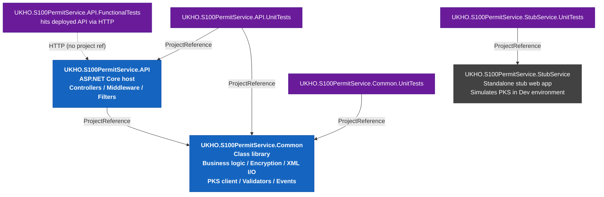
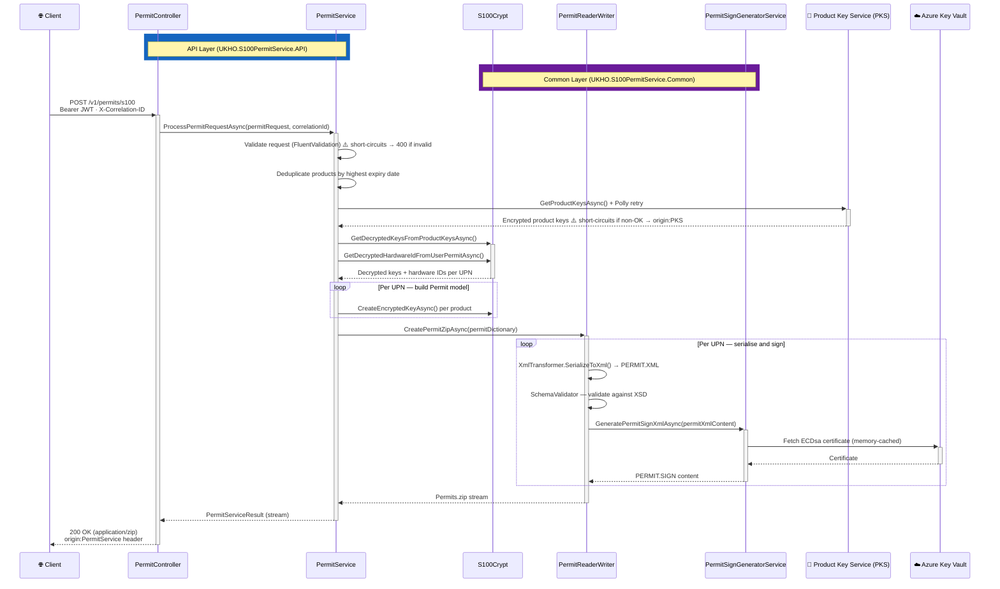
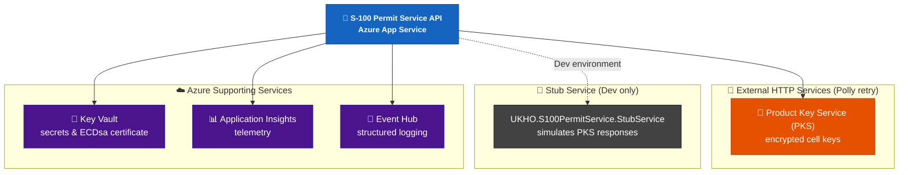
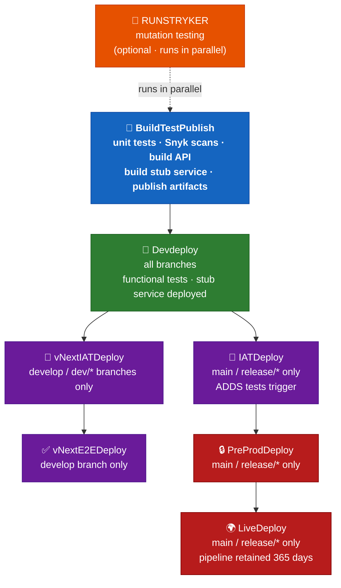
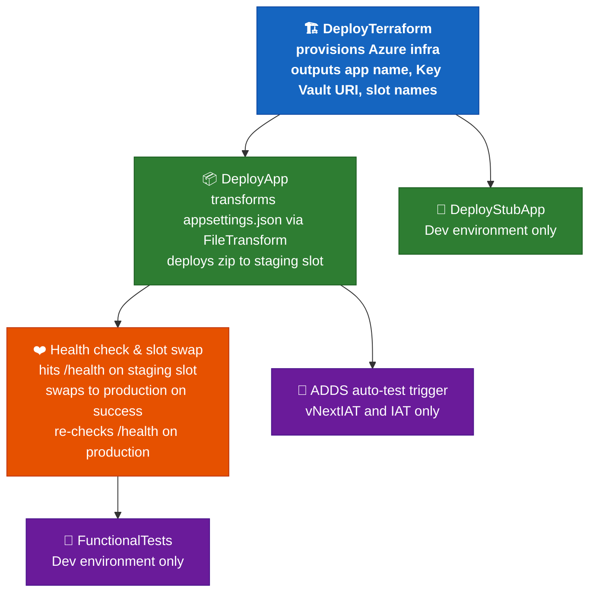

# Copilot Instructions for S-100 Permit Service

## Build & Test Commands

```bash
# Build the solution
dotnet build S100PermitService.sln

# Run all unit tests (with coverage)
dotnet test S100PermitService.sln --settings test.runsettings

# Run tests for a specific project
dotnet test tests/UKHO.S100PermitService.Common.UnitTests/UKHO.S100PermitService.Common.UnitTests.csproj
dotnet test tests/UKHO.S100PermitService.API.UnitTests/UKHO.S100PermitService.API.UnitTests.csproj

# Run a single test by name
dotnet test tests/UKHO.S100PermitService.Common.UnitTests/ --filter "FullyQualifiedName~PermitServiceTests.WhenPermitXmlHasValue"

# Generate HTML code coverage report
.\CodeCoverageReport.ps1

# Run Stryker mutation tests (from a test project directory)
cd tests/UKHO.S100PermitService.API.UnitTests && dotnet-stryker
```

Local configuration overrides go in `src/UKHO.S100PermitService.API/appsettings.local.overrides.json` (loaded in `DEBUG` builds only, gitignored).

---

## Architecture

S-100 Permit Service is an ASP.NET Core 8 API that generates S-100 standard `PERMIT.XML` files (IHO S-100 Part 15 data protection scheme) per User Permit Number (UPN) and returns them in a compressed ZIP archive.

- **POST `/v1/permits/s100`** — validates the request, deduplicates products by highest expiry date, retrieves encrypted product keys from the **Product Key Service (PKS)**, decrypts them using `S100Crypt`, builds one `PERMIT.XML` and one `PERMIT.SIGN` per UPN, and returns a `Permits.zip` stream.

### Project layout

| Project | Role |
|---|---|
| `src/UKHO.S100PermitService.API` | Web API host — controllers, middleware, filters, DI wiring |
| `src/UKHO.S100PermitService.Common` | Shared library — business logic, encryption, XML I/O, PKS client, validators, event IDs |
| `src/UKHO.S100PermitService.StubService` | Standalone stub web app deployed alongside the API in Dev; simulates PKS responses for functional tests |
| `tests/UKHO.S100PermitService.API.UnitTests` | NUnit unit tests for the API project |
| `tests/UKHO.S100PermitService.Common.UnitTests` | NUnit unit tests for the Common project |
| `tests/UKHO.S100PermitService.StubService.UnitTests` | NUnit unit tests for the Stub Service project |
| `tests/UKHO.S100PermitService.API.FunctionalTests` | End-to-end functional tests run against a deployed environment |

### Project dependency diagram



### Request flow



### Runtime dependency diagram



---

## Functional Test Setup

Functional tests (`tests/UKHO.S100PermitService.API.FunctionalTests`) run against a **live deployed environment** — they are not in-process and do not mock anything. They require real Azure AD credentials and a running API instance (with the stub service deployed in Dev).

### Configuration

Fill in `tests/UKHO.S100PermitService.API.FunctionalTests/appsettings.json` before running locally:

```json
{
  "PermitServiceApiConfiguration": {
    "BaseUrl": "<deployed API base URL>",
    "InvalidToken": "TestInvalidToken"
  },
  "TokenConfiguration": {
    "MicrosoftOnlineLoginUrl": "https://login.microsoftonline.com/",
    "TenantId": "<tenant GUID>",
    "ClientId": "<API app registration client ID>",
    "ClientIdWithAuth": "<test client with PermitServiceUser role>",
    "ClientSecret": "<test client secret>",
    "ClientIdNoAuth": "<test client without role>",
    "ClientSecretNoAuth": "<test client secret without role>",
    "IsRunningOnLocalMachine": true
  },
  "KeyVaultSettings": {
    "ServiceUri": "<Key Vault URI>"
  },
  "DataKeyVaultConfiguration": {
    "DsCertificateSecret": "<certificate secret name in Key Vault>"
  }
}
```

Set `IsRunningOnLocalMachine: true` to trigger interactive browser authentication instead of the client-credentials flow. In CI, credentials are injected via Azure DevOps variable groups using `FileTransform` on `appsettings.json`.

### Auth flow

```
AuthTokenProvider.GetPermitServiceTokenAsync(clientId, clientSecret)
  │
  ├─ IsRunningOnLocalMachine=true  → PublicClientApplicationBuilder with TokenConfiguration.ClientId
  │                                  interactive browser auth (AcquireTokenInteractive)
  │                                  scope: {ClientId}/.default
  │
  └─ IsRunningOnLocalMachine=false → ConfidentialClientApplicationBuilder with clientId + clientSecret
                                      client credentials flow (AcquireTokenForClient)
                                      scope: {ClientId}/.default
```

### Test fixture base class

All test classes extend `TestBase`, which builds a `ServiceProvider` from `appsettings.json` via `TestConfiguration.ConfigureServices()`. `PermitServiceEndPointFactory` (static helper) is initialised in `[OneTimeSetUp]` with the base URL and a logger. It handles HTTP calls, ZIP downloading, and extraction to `Path.GetTempPath()/temp/`. The `[TearDown]` method deletes the temp folder after each test.

### Test payload reference

Test payloads live in `tests/UKHO.S100PermitService.API.FunctionalTests/TestData/Payload/`. All `permitExpiryDate` values (except in `payloadWithPastExpiry.json`) are overwritten at runtime with `DateTime.Now.AddYears(1)`.

| Payload file | Expected behaviour |
|---|---|
| `validPayload.json` | Valid request → 200 OK · `Permits.zip` · `origin: PermitService` |
| `50ProductsPayload.json` | 50 products + 3 UPNs → 200 OK · ZIP structure and PERMIT.XML contents verified |
| `duplicateProductsPayload.json` | Duplicate products → permits use the highest expiry date |
| `payloadWithPastExpiry.json` | Past expiry date → 400 Bad Request |
| `unauthorisedPKSRequest.json` | PKS returns 401 → 401 · `origin: PKS` |
| `forbiddenPKSRequest.json` | PKS returns 403 → 403 · `origin: PKS` |
| `notFoundPKSRequest.json` | PKS returns 404 → 400 · `origin: PKS` |

The 200 OK tests additionally verify: ZIP file names contain no invalid characters, permit headers match expected values, each UPN maps to a `PERMIT.XML`, and the `PERMIT.SIGN` digital signature is valid against the certificate in Key Vault.

---

## Deployment Pipeline

The pipeline is defined in `azure-pipelines.yml` and uses templates under `Deployment/templates/`. It runs on the **NautilusBuild** pool (.NET 8 SDK) and triggers on `main`, `develop`, and `release/*`.

### Pipeline stages



### Per-environment deploy jobs



### Key pipeline details

- **Assembly version** is stamped by `Apply-AssemblyVersionAndDefaults.ps1` before build using the build number (`1.0.<date>.<counter>`).
- **Snyk** runs three parallel scans in `BuildTestPublish`: SAST (code), SCA (open-source dependencies), and IaC (Terraform).
- **NuGet restore** uses `BuildNuget.config` (custom feed configuration).
- **Terraform** runs in a container (`ukhydrographicoffice/terraform-azure-powershell-unzip:1.9.2`); infrastructure outputs (web app name, slot name, Key Vault URI, resource group) are passed between jobs as pipeline variables.
- **App Service deployment** uses a staging slot: deploy → health-check staging slot → swap to production → health-check production.
- An **EventId runbook** RTF is generated from the compiled XML documentation and published as a build artifact (`Runbook`).
- Target SDK: **.NET 8.0**.

---

## Key Conventions

### Result pattern

All service return values extend `Result<T>` via a typed subclass (`PermitServiceResult : Result<Stream>`). Each subclass has static factory methods:

```csharp
PermitServiceResult.Success(stream)
PermitServiceResult.Failure(HttpStatusCode.BadRequest, PermitServiceConstants.PermitService, errorResponse)
```

Controllers switch on `.StatusCode` (`HttpStatusCode`) via `BaseController.ToActionResult()`, which also appends the `origin` response header. `IsSuccess` is true only when `StatusCode == HttpStatusCode.OK`.

### EventIds & logging

Every log statement must use a named `EventIds` enum value (range starts at `840001`) converted via `.ToEventId()`:

```csharp
_logger.LogInformation(EventIds.ProcessPermitRequestStarted.ToEventId(), "Process permit request started for ProductType {ProductType}.", PermitServiceConstants.ProductType);
```

When adding new log calls, add a new entry to `src/UKHO.S100PermitService.Common/Events/EventIds.cs` with the next available integer and an XML doc comment. Never log without an EventId.

### Constructor null guards

Every class with injected dependencies guards each parameter:

```csharp
_service = service ?? throw new ArgumentNullException(nameof(service));
```

Unit tests must verify each guard with a dedicated `ArgumentNullException` assertion per parameter.

### Authorization

Single role-based policy defined in `PermitServiceConstants`:

- `PermitServicePolicy` (`"PermitServiceUser"`) — `[Authorize]` is applied at the controller class level; `[Authorize(Policy = PermitServiceConstants.PermitServicePolicy)]` is applied at the action method level.

Azure AD JWT Bearer auth scheme is registered as `"AzureAd"`.

### Testing conventions

- **Framework:** NUnit + FakeItEasy
- Fakes are created with `A.Fake<T>()` and configured with `A.CallTo(…).Returns(…)`.
- Test methods follow the naming pattern: `When<Condition>_Then<ExpectedOutcome>`.
- `[TestFixture]` / `[SetUp]` / `[Test]` / `[TestCase(…)]` attributes are used throughout.
- **Mutation testing:** Stryker with `stryker-config.json` per test project.

### ExcludeFromCodeCoverage

Apply `[ExcludeFromCodeCoverage]` to: DTOs/models, configuration POCOs, `Program.cs` wiring, and infrastructure-layer code that cannot be unit tested. Do not apply it to business logic.

### Constants

All shared string constants live in `PermitServiceConstants`. Do not scatter magic strings across the codebase.

### XML / Permit schema

The `PERMIT.XML` namespace is `http://www.iho.int/s100/se/5.0`. The XSD lives at `src/UKHO.S100PermitService.Common/XmlSchema/Permit_Schema.xsd`. Schema validation occurs in `SchemaValidator` (inside `PermitReaderWriter`) before each file is added to the ZIP.

### Configuration

All configuration classes live in `src/UKHO.S100PermitService.Common/Configuration/`. Secrets are sourced from **Azure Key Vault** (URI via `KeyVaultSettings:ServiceUri`); runtime config uses `IOptions<T>` binding. Configuration precedence: Key Vault → environment variables → `appsettings.json` → `appsettings.local.overrides.json` (DEBUG only).