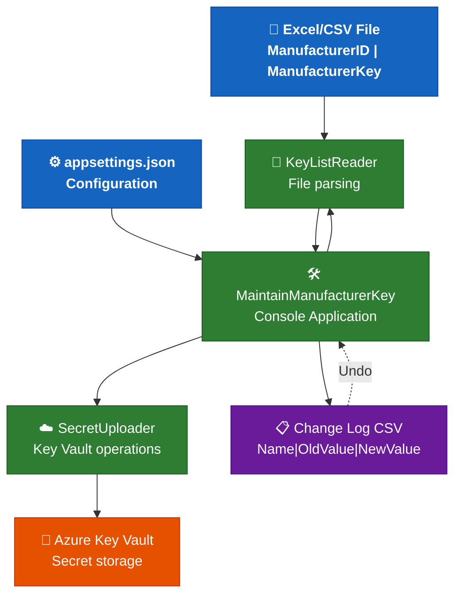
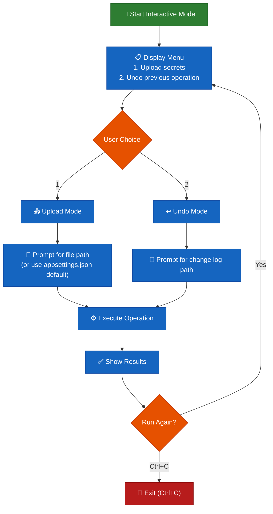
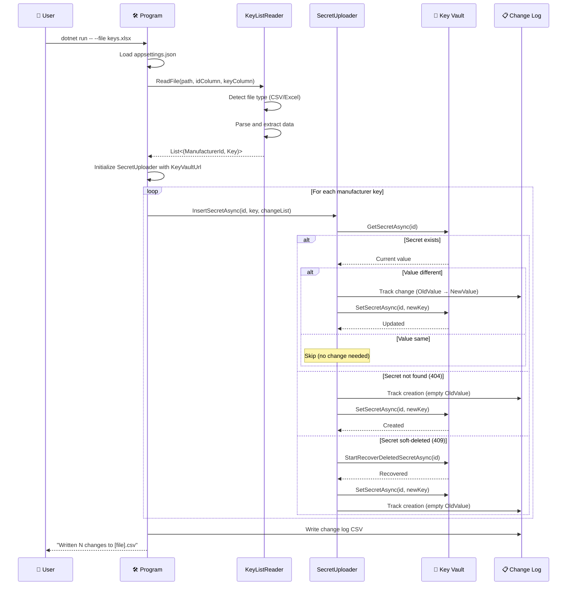
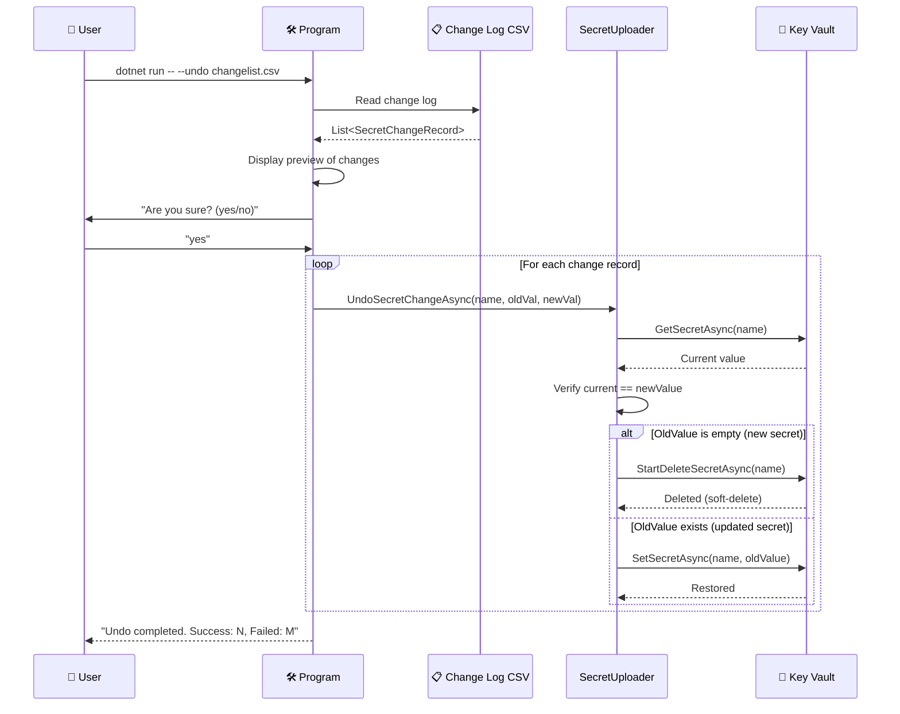
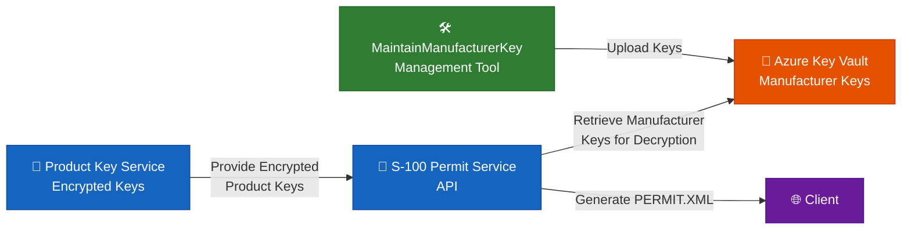

# MaintainManufacturerKey Tool Instructions

## Build & Run Commands

```bash
# Build the tool
dotnet build tools/MaintainManufacturerKey/MaintainManufacturerKey.csproj

# Run interactive mode (no arguments)
cd tools/MaintainManufacturerKey
dotnet run

# Run with command-line arguments - upload from file
dotnet run --project tools/MaintainManufacturerKey/MaintainManufacturerKey.csproj -- --file "C:\Data\ManufacturerKeys.xlsx"
dotnet run --project tools/MaintainManufacturerKey/MaintainManufacturerKey.csproj -- -f "path\to\keys.xlsx"

# Run with command-line arguments - undo operation
dotnet run --project tools/MaintainManufacturerKey/MaintainManufacturerKey.csproj -- --undo "ExistingSecrets.csv"
dotnet run --project tools/MaintainManufacturerKey/MaintainManufacturerKey.csproj -- -u "path\to\changelog.csv"

# Publish standalone executable
dotnet publish tools/MaintainManufacturerKey/MaintainManufacturerKey.csproj -c Release -o ./publish
```

Configuration file location: `tools/MaintainManufacturerKey/appsettings.json` (required for operation).

---

## Purpose & Architecture

**MaintainManufacturerKey** is a command-line utility designed to bulk-upload manufacturer encryption keys from Excel or CSV files into Azure Key Vault as secrets. It is essential for initializing and maintaining the manufacturer key database required by the S-100 Permit Service's data protection scheme (IHO S-100 Part 15).

### Core Features

- Bulk upload manufacturer keys from Excel (`.xlsx`, `.xls`) or CSV (`.csv`) files
- Password-protected Excel file support with interactive or pre-configured passwords
- Automatic soft-delete recovery for deleted secrets
- Change tracking with comprehensive audit logs (CSV format)
- Undo/rollback operations using change logs
- Duplicate detection and smart update logic
- Interactive and command-line modes for flexible usage

### Architecture Diagram



### Component Responsibilities

| Component | File | Responsibility |
|---|---|---|
| **Program** | `Program.cs` | Entry point, CLI argument parsing, orchestration, interactive mode, configuration loading |
| **KeyListReader** | `KeyListReader.cs` | Excel/CSV file parsing, password handling, header row detection, data extraction |
| **SecretUploader** | `SecretUploader.cs` | Azure Key Vault SDK operations (create/update/recover/delete secrets) |
| **AppSettings** | `Configuration/AppSettings.cs` | Configuration model bound from `appsettings.json` |
| **Options** | `Options.cs` | Command-line argument model using CommandLineParser library |
| **ExecutionContext** | `ExecutionContext.cs` | Runtime context encapsulating configuration values for each operation |
| **SecretChangeRecord** | `SecretChangeRecord.cs` | Change log record model (Name, OldValue, NewValue) |

---

## Configuration

### appsettings.json Structure

Create or update `tools/MaintainManufacturerKey/appsettings.json` with the following structure:

```json
{
  "KeyVaultUrl": "https://your-keyvault-name.vault.azure.net/",
  "FilePath": "C:\\Data\\ManufacturerKeys.xlsx",
  "ErrorListFilePath": "ExistingSecrets.csv",
  "ManufacturerIdColumnName": "Manufacturer ID",
  "ManufacturerKeyColumnName": "Manufacturer Key",
  "Password": null,
  "MaxRowsToSearchForHeader": 50,
  "EventSourceLogging": false
}
```

### Configuration Properties

| Property | Type | Required | Description |
|---|---|---|---|
| `KeyVaultUrl` | string | ✅ Yes | Full URI of the Azure Key Vault (e.g., `https://<vault-name>.vault.azure.net/`) |
| `FilePath` | string | ✅ Yes | Default path to the Excel or CSV file containing manufacturer keys |
| `ErrorListFilePath` | string | ✅ Yes | Output path for the change log CSV file (defaults to `ExistingSecrets.csv`) |
| `ManufacturerIdColumnName` | string | ✅ Yes | Exact column header name for manufacturer ID (becomes Key Vault secret name) |
| `ManufacturerKeyColumnName` | string | ✅ Yes | Exact column header name for encryption key (becomes Key Vault secret value) |
| `Password` | string | ❌ No | Optional pre-configured password for password-protected Excel files (if null, prompts interactively) |
| `MaxRowsToSearchForHeader` | int | ❌ No | Maximum number of rows to scan for header row (default: `50`) |
| `EventSourceLogging` | bool | ❌ No | Enable Azure SDK verbose logging for debugging (default: `false`) |

### Azure Prerequisites

1. **Azure Key Vault** — A Key Vault instance must exist
2. **Azure Authentication** — One of the following must be configured:
   - Azure CLI: `az login`
   - Visual Studio credentials (Tools → Options → Azure Service Authentication)
   - Managed Identity (if running in Azure)
   - Environment variables with service principal credentials
3. **RBAC Permissions** — Your identity needs one of:
   - `Key Vault Secrets Officer` (recommended)
   - `Key Vault Administrator`
   - Custom role with `Microsoft.KeyVault/vaults/secrets/write` and `Microsoft.KeyVault/vaults/secrets/delete` permissions

---

## Usage Modes

### Interactive Mode

Interactive mode provides a guided experience with prompts and repeatable operations.

```bash
cd tools/MaintainManufacturerKey
dotnet run
```

**Workflow:**



**Features:**
- Configuration is reloaded from `appsettings.json` before each operation
- Press `Ctrl+C` at any time to exit gracefully
- File paths can be entered interactively or use configured defaults
- Operations can be repeated without restarting the application

### Command-Line Mode

Command-line mode is suitable for scripting, automation, and CI/CD pipelines.

```bash
# Upload manufacturer keys from a file
dotnet run --project tools/MaintainManufacturerKey/MaintainManufacturerKey.csproj -- --file "C:\Data\Keys.xlsx"

# Undo a previous operation using the change log
dotnet run --project tools/MaintainManufacturerKey/MaintainManufacturerKey.csproj -- --undo "ExistingSecrets_20260515_143022.csv"
```

**Command-Line Arguments:**

| Argument | Short | Description | Example |
|---|---|---|---|
| `--file` | `-f` | Path to Excel or CSV file for upload | `--file "C:\Data\Keys.xlsx"` |
| `--undo` | `-u` | Path to change log CSV for rollback | `--undo "ExistingSecrets.csv"` |

**Exit Codes:**
- `0` — Success
- `1` — Error (configuration, file not found, Key Vault error, validation failure)

---

## Input File Formats

### Expected File Structure

| Manufacturer ID | Manufacturer Key |
|---|---|
| `MFR001` | `A1B2C3D4E5F6...` |
| `MFR002` | `F6E5D4C3B2A1...` |
| `MFR003` | `1234567890AB...` |

### File Format Requirements

- **Header row** must contain the exact column names configured in `ManufacturerIdColumnName` and `ManufacturerKeyColumnName`
- Header row can appear anywhere within the first `MaxRowsToSearchForHeader` rows
- **Empty rows** are automatically skipped
- **Duplicate manufacturer IDs** are processed (last occurrence wins)
- **Column order** does not matter; columns are matched by header name

### Supported File Types

| Extension | Description | Notes |
|---|---|---|
| `.csv` | Comma-Separated Values | Auto-detects separator (`,` or `;`) |
| `.xlsx` | Excel 2007+ | Supports password protection |
| `.xls` | Excel 97-2003 | Supports password protection |

### Password-Protected Files

When an Excel file is password-protected:

1. **Pre-configured password** in `appsettings.json`:
   ```json
   {
     "Password": "YourPassword123"
   }
   ```
   The tool attempts to open the file using this password first.

2. **Interactive password prompt**:
   If the configured password fails or is not set, the tool prompts for a password (masked with `*****`).
   - **Maximum attempts:** 3
   - **Behavior:** After 3 failed attempts, the operation aborts with an error

---

## Operational Flow

### Upload Operation Sequence



### Undo Operation Sequence



---

## Change Log Format

### Structure

The change log CSV contains three columns:

| Name | OldValue | NewValue |
|---|---|---|
| `MFR001` | *(empty)* | `A1B2C3D4E5F6...` |
| `MFR002` | `PreviousKey123` | `F6E5D4C3B2A1...` |
| `MFR003` | `OldKey456` | `1234567890AB...` |

### Interpretation

| OldValue | NewValue | Meaning | Undo Behavior |
|---|---|---|---|
| *(empty)* | `<key>` | Secret was newly created | **DELETE** the secret |
| `<key>` | `<key>` | Secret was updated | **RESTORE** the old value |

### File Naming

- **Default:** `ExistingSecrets.csv` (configured in `ErrorListFilePath`)
- **Duplicate prevention:** If the file already exists, a timestamp is appended:
  - Example: `ExistingSecrets_20260515_143022.csv`
  - Format: `<basename>_<yyyyMMdd>_<HHmmss>.csv`

---

## Key Conventions

### Logging

All logging uses **Serilog** with structured logging to the console.

```csharp
Log.Information("Starting insert operation for {RecordCount} records...", data.Count());
Log.Warning("Secret {SecretName} already exists. Old value: {OldValue}, New value: {NewValue}", name, oldValue, newValue);
Log.Error(ex, "Error on key {ManufacturerId}", manufacturerId);
```

**Log Levels:**
- `Information` — Normal operational messages
- `Warning` — Unexpected conditions that don't prevent operation (existing secrets, password retries)
- `Error` — Failures that prevent a specific operation (Key Vault errors, file parsing errors)
- `Debug` — Detailed trace information (disabled by default)

### Error Handling

- **File not found:** Logs error and exits with code `1`
- **Configuration missing:** Logs error and exits with code `1`
- **Key Vault authorization failure:** Logs error with exception details and exits
- **Password failures:** Allows 3 attempts before failing
- **Per-secret failures:** Logged but operation continues for remaining secrets

### Secret Naming

Manufacturer IDs from the input file become Key Vault secret names directly. Ensure they meet Azure Key Vault naming requirements:
- **Allowed characters:** Alphanumeric and hyphens (`a-z`, `A-Z`, `0-9`, `-`)
- **Length:** 1-127 characters
- **Case-insensitive:** Key Vault normalizes to lowercase

### Azure SDK Authentication

Uses `DefaultAzureCredential` with interactive browser credential enabled:

```csharp
new DefaultAzureCredential(new DefaultAzureCredentialOptions
{
    ExcludeInteractiveBrowserCredential = false
})
```

**Credential chain order:**
1. Environment variables (`AZURE_CLIENT_ID`, `AZURE_TENANT_ID`, `AZURE_CLIENT_SECRET`)
2. Managed Identity (if running in Azure)
3. Visual Studio credentials
4. Azure CLI credentials (`az login`)
5. Interactive browser authentication (fallback)

---

## Common Usage Scenarios

### Scenario 1: Initial Bulk Upload

**Situation:** First-time setup of manufacturer keys in a new Key Vault.

```bash
dotnet run --project tools/MaintainManufacturerKey/MaintainManufacturerKey.csproj -- --file "InitialKeys.xlsx"
```

**Expected behavior:**
- All secrets are new → `OldValue` is empty in the change log
- Change log tracks all created secrets
- Change log can be used to delete all newly created secrets if needed

### Scenario 2: Update Existing Keys

**Situation:** Manufacturer keys have changed and need to be updated in Key Vault.

```bash
dotnet run --project tools/MaintainManufacturerKey/MaintainManufacturerKey.csproj -- --file "UpdatedKeys.xlsx"
```

**Expected behavior:**
- Existing secrets are updated → `OldValue` captures previous values
- New secrets are created → `OldValue` is empty
- Unchanged secrets are skipped → Not included in change log
- Change log can restore all previous values if needed

### Scenario 3: Rollback After Incorrect Upload

**Situation:** Wrong file was uploaded or incorrect values were provided.

```bash
# Step 1: Upload (mistake made)
dotnet run -- --file "WrongKeys.xlsx"
# Output: Written 25 changes to ExistingSecrets_20260515_143022.csv

# Step 2: Immediately undo
dotnet run -- --undo "ExistingSecrets_20260515_143022.csv"
```

**Expected behavior:**
- Tool shows preview of changes to be reverted
- Prompts for confirmation
- Restores all previous values
- Deletes newly created secrets
- Logs success/failure count

### Scenario 4: Password-Protected Excel File

**Situation:** Excel file contains sensitive data and is password-protected.

**Option A — Pre-configured password:**
```json
{
  "Password": "YourSecurePassword123"
}
```

**Option B — Interactive prompt:**
```bash
dotnet run -- --file "SecureKeys.xlsx"
# Tool prompts: "Enter password (attempt 1/3): "
# User enters password (masked as *****)
```

### Scenario 5: Automated CI/CD Pipeline

**Situation:** Keys need to be updated as part of deployment pipeline.

```yaml
# Azure DevOps pipeline step
- task: DotNetCoreCLI@2
  displayName: 'Upload Manufacturer Keys'
  inputs:
    command: 'run'
    projects: 'tools/MaintainManufacturerKey/MaintainManufacturerKey.csproj'
    arguments: '-- --file "$(Pipeline.Workspace)/drop/ManufacturerKeys.xlsx"'
  env:
    AZURE_CLIENT_ID: $(ClientId)
    AZURE_TENANT_ID: $(TenantId)
    AZURE_CLIENT_SECRET: $(ClientSecret)
```

---

## Troubleshooting

### Error: "Could not read or parse appsettings.json"

**Cause:** Configuration file is missing, contains invalid JSON, or required properties are not set.

**Solution:**
1. Ensure `appsettings.json` exists in `tools/MaintainManufacturerKey/`
2. Validate JSON syntax using a JSON validator
3. Verify all required properties are present (see Configuration section)

### Error: "File not found: [path]"

**Cause:** File path is incorrect or file does not exist.

**Solution:**
1. Use absolute paths or verify relative path is correct
2. Remove surrounding quotes when entering path interactively
3. Escape backslashes in JSON configuration: `C:\\Data\\Keys.xlsx`

### Error: "Failed to open the Excel file after 3 attempts"

**Cause:** Excel file is password-protected and correct password was not provided.

**Solution:**
1. Add password to `appsettings.json` under `Password` property
2. Verify password is correct by opening the file in Excel
3. Check for file corruption by attempting to open in Excel

### Error: "Unauthorized" or "Forbidden" (Key Vault)

**Cause:** Current identity lacks necessary permissions in Key Vault.

**Solution:**
1. Run `az login` and verify correct account
2. Check RBAC assignments in Azure Portal:
   - Navigate to Key Vault → Access control (IAM)
   - Verify identity has `Key Vault Secrets Officer` role
3. If using Managed Identity, ensure it's assigned to the resource and has permissions

### Error: "Secret [name] has been modified since the operation" (during undo)

**Cause:** Secret value has changed since the change log was created.

**Solution:**
1. Review current secret value in Key Vault
2. Manually verify if the change should be reverted
3. Edit the change log CSV to match current values if needed
4. This is a safety check to prevent overwriting intentional changes

### Warning: "Secret [name] is in deleted state. Recovering and updating..."

**Cause:** Secret was previously soft-deleted (Key Vault's soft-delete feature).

**Behavior:** This is automatically handled — the tool recovers the secret and updates it.

**Note:** Soft-deleted secrets can be recovered within the retention period (default 90 days).

### Password prompt not appearing in CI/CD

**Cause:** Interactive prompts don't work in automated environments.

**Solution:**
- Always configure `Password` in `appsettings.json` for automated scenarios
- Use secret variables in CI/CD to inject password into configuration

### EventSourceLogging generates excessive output

**Cause:** Azure SDK diagnostic logging is enabled.

**Solution:**
- Set `EventSourceLogging: false` in `appsettings.json`
- Only enable for debugging Azure SDK-related issues

---

## Testing the Tool

### Manual Testing Checklist

- [ ] Upload new secrets (all `OldValue` empty)
- [ ] Update existing secrets (all `OldValue` populated)
- [ ] Mix of new and updated secrets
- [ ] File with duplicate manufacturer IDs (last wins)
- [ ] Password-protected Excel file
- [ ] CSV file with comma separator
- [ ] CSV file with semicolon separator
- [ ] Undo operation restoring old values
- [ ] Undo operation deleting new secrets
- [ ] Soft-deleted secret recovery
- [ ] Header row not in first row (within MaxRowsToSearchForHeader)
- [ ] Empty rows in input file
- [ ] Interactive mode with repeat operations
- [ ] Command-line mode exit codes

### Test Data Example

**Create test Excel file:** `TestKeys.xlsx`

| Manufacturer ID | Manufacturer Key |
|---|---|
| `TEST001` | `TESTKEY0001234567890ABCDEF` |
| `TEST002` | `TESTKEY0002345678901BCDEFG` |
| `TEST003` | `TESTKEY0003456789012CDEFGH` |

**Upload test:**
```bash
dotnet run -- --file "TestKeys.xlsx"
```

**Verify in Azure:**
```bash
az keyvault secret show --vault-name <your-vault> --name TEST001
```

**Undo test:**
```bash
dotnet run -- --undo "ExistingSecrets.csv"
```

**Cleanup test secrets:**
```bash
az keyvault secret delete --vault-name <your-vault> --name TEST001
az keyvault secret delete --vault-name <your-vault> --name TEST002
az keyvault secret delete --vault-name <your-vault> --name TEST003
```

---

## Dependencies

### NuGet Packages

| Package | Version Range | Purpose |
|---|---|---|
| `Azure.Security.KeyVault.Secrets` | Latest stable | Azure Key Vault SDK for secret operations |
| `Azure.Identity` | Latest stable | Azure authentication (DefaultAzureCredential) |
| `ExcelDataReader` | Latest stable | Excel file parsing (`.xlsx`, `.xls`) |
| `ExcelDataReader.DataSet` | Latest stable | ExcelDataReader dependency |
| `System.Text.Encoding.CodePages` | Latest stable | Required for ExcelDataReader encoding support |
| `CommandLineParser` | Latest stable | Command-line argument parsing |
| `CsvHelper` | Latest stable | CSV file reading and writing |
| `Serilog` | Latest stable | Structured logging framework |
| `Serilog.Sinks.Console` | Latest stable | Console logging sink |

### Target Framework

- **.NET 8.0** (`net8.0`)

---

## Integration with S-100 Permit Service

The MaintainManufacturerKey tool supports the S-100 Permit Service by managing the manufacturer encryption keys required for the **S-100 data protection scheme** (IHO S-100 Part 15).

### Relationship to Permit Service



### Workflow Context

1. **Manufacturer keys are uploaded** using MaintainManufacturerKey tool → Stored in Key Vault
2. **Client requests a permit** from S-100 Permit Service
3. **Permit Service retrieves encrypted product keys** from Product Key Service (PKS)
4. **Permit Service retrieves manufacturer keys** from Key Vault (uploaded by this tool)
5. **Permit Service decrypts product keys** using manufacturer keys via `S100Crypt`
6. **Permit Service generates PERMIT.XML** files and returns them to the client

---

## Best Practices

### Security

- ✅ Never commit `appsettings.json` with real Key Vault URLs or passwords to source control
- ✅ Use Azure Key Vault references for sensitive configuration in production
- ✅ Rotate manufacturer keys regularly and use this tool to update them
- ✅ Review change logs before performing undo operations
- ✅ Use RBAC with least privilege (Secrets Officer, not Administrator)
- ✅ Enable Key Vault soft-delete and purge protection

### Operational

- ✅ Always test uploads in a non-production Key Vault first
- ✅ Keep change log files for audit purposes
- ✅ Document manufacturer key update procedures in your runbook
- ✅ Use command-line mode in automation/CI/CD for consistency
- ✅ Validate input files before running bulk operations
- ✅ Schedule regular key updates as part of security maintenance

### Development

- ✅ Follow the Result pattern for error handling in new code
- ✅ Add XML documentation comments to all public methods
- ✅ Use constructor null guards for all injected dependencies
- ✅ Log all Key Vault operations with appropriate log levels
- ✅ Handle Azure SDK exceptions with specific catch blocks
- ✅ Write unit tests for new features using NUnit + FakeItEasy

---

## Future Enhancements

Potential improvements for consideration:

- [ ] Add support for JSON input format
- [ ] Implement secret versioning awareness
- [ ] Add dry-run mode (preview changes without executing)
- [ ] Support for secret metadata/tags
- [ ] Parallel processing for large files
- [ ] Export existing secrets from Key Vault to Excel/CSV
- [ ] Email notifications for successful operations
- [ ] Integration with Azure DevOps/GitHub Actions as a reusable task
- [ ] Support for multiple Key Vaults in a single operation
- [ ] Validation against manufacturer key format requirements

---

## Support & Maintenance

### Ownership

This tool is maintained by the S-100 Permit Service development team.

### Documentation Updates

When modifying the tool:
1. Update this instruction file with any changes to behavior or configuration
2. Update XML documentation comments in code
3. Add new scenarios to the troubleshooting section if applicable
4. Update the architecture diagrams if workflow changes

### Related Documentation

- Main project instructions: `.github/copilot-instructions.md`
- S-100 Permit Service API documentation
- Azure Key Vault documentation: https://learn.microsoft.com/en-us/azure/key-vault/
- IHO S-100 Part 15 Data Protection Scheme specification
